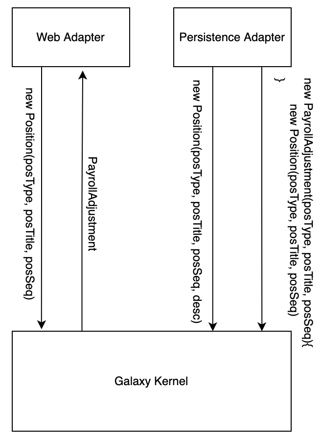

# [Data Mapper](https://martinfowler.com/eaaCatalog/dataMapper.html)
--------------
Objects and relational databases have different machanisms for structuring data. Many parts of an object, such as collections and inheritance, aren't present in relational database. So developers need to transfer data between those two schemas, and this data transfer becomes a complexity in its own right. If the in-memory objects know about the relational database structure, change in one tend to ripple to the other.

### Mapping Data to Entity Fields

1. Rich Constructor: created with alll its mandatory data. One constructor for transfering from Position database table to Position Entity; one constructor for transfering Position request to Position Entity; one constructor for transfering Position adjustment database table to Position Entity;

2. Reflection

Look the code of Laravel Model

In Spring

~~~
<dependency>
    <groupId>org.modelmapper</groupId>
    <artifactId>modelmapper</artifactId>
    <version>3.1.0</version>
</dependency>
~~~

~~~ java
private PostDto convertToDto(Post post) {
    PostDto postDto = modelMapper.map(post, PostDto.class);
    postDto.setSubmissionDate(post.getSubmissionDate(), 
        userService.getCurrentUser().getPreference().getTimezone());
    return postDto;
}

private Post convertToEntity(PostDto postDto) throws ParseException {
    Post post = modelMapper.map(postDto, Post.class);
    post.setSubmissionDate(postDto.getSubmissionDateConverted(
      userService.getCurrentUser().getPreference().getTimezone()));
 
    if (postDto.getId() != null) {
        Post oldPost = postService.getPostById(postDto.getId());
        post.setRedditID(oldPost.getRedditID());
        post.setSent(oldPost.isSent());
    }
    return post;
}
~~~