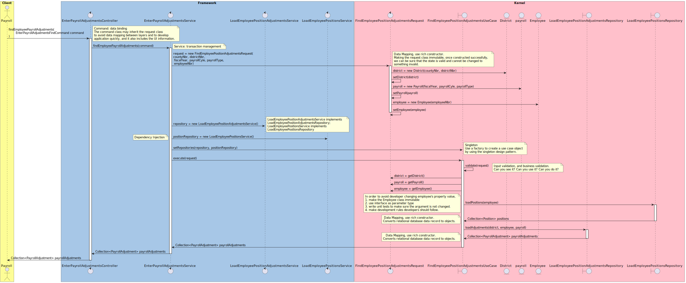

# New Design

~~~
@startuml

box "Client" #FDFD96
actor actor as "Payroll"
end box

box "Framework" #A7C7E7
    control controller as "EnterPayrollAdjustmentsController"
    control service as "EnterPayrollAdjustmentsService"
    control repositoryService as "LoadEmployeePositionAdjustmentsService"
    control positionRepositoryService as "LoadEmployeePositionsService"
end box
box "Kernel" #FFC0CB
    control request as "FindEmployeePositionAdjustmentsRequest"
    boundary useCase as "FindEmployeePositionAdjustmentsUseCase"
    entity district as "District"
    entity payroll as "payroll"
    entity employee as "Employee"
    boundary repository as "LoadEmployeePositionAdjustmentsRepository"
    boundary positionRepository as "LoadEmployeePositionsRepository"
end box

actor -> controller : findEmployeePayrollAdjustments(\n\tEnterPayrollAdjustmentsFindCommand command\n)
activate controller
    note right
      Command: data binding
      The command class may inherit the request class
      to avoid data mapping between layers and to develop
      application quickly, and it also includes the UI information.
    end note
    controller -> service: findEmployeePayrollAdjustments(command)
    activate service
        note right
          Service: transaction management
        end note
        service -> request: request = new FindEmployeePositionAdjustmentsRequest(\ncountyNbr, districtNbr,\n fiscalYear, payrollCyle, payrollType,\n employeeNbr)
            note right
               Data Mapping, use rich constructor.
               Making the request class immutable, once constructed successfully,
               we can be sure that the state is valid and cannot be changed to 
               something invalid.
            end note
        activate request
            request -> district: district = new District(countyNbr, districtNbr) 
            request -> request: setDistrict(district)
            request -> payroll: payroll = new Payroll(fiscalYear, payrollCyle, payrollType)
            request -> request: setPayroll(payroll)
            request -> employee: employee = new Employee(employeeNbr)
            request -> request: setEmployee(employee)
        deactivate request
            service -> repositoryService: repository = new LoadEmployeePositionAdjustmentsService()
            note right
                LoadEmployeePositionAdjustmentsService implements
                LoadEmployeePositionAdjustmentsRepository;
                LoadEmployeePositionsService implements
                LoadEmployeePositionsRepository
            end note
            service -> positionRepositoryService: positionRepository = new LoadEmployeePositionsService()
            note left
                Dependency Injection
            end note
            service -> useCase : setRepositories(repository, positionRepository)
            note right
                Singleton
                Use a factory to create a use case object
                by using the singleton design pattern.
            end note
            service -> useCase : execute(request)
        activate useCase
            useCase -> useCase : validate(request)
            note right
                Input validation, and business validation.
                Can you see it? Can you use it? Can you do it?
            end note
            useCase -> request: district = getDistrict()
            useCase -> request: payroll = getPayroll()
            useCase -> request: employee = getEmployee()
            useCase -> positionRepository: loadPositions(employee)
            note left
               In order to avoid developer changing employee's property value,
               1. make the Employee class immutable
               2. use interface as parameter type
               3. write unit tests to make sure the argument is not changed.
               4. make development rules developers should follow.
            end note
            activate positionRepository
            useCase <- positionRepository: Collection<Position> positions
            note left
               Data Mapping, use rich constructor.
              Converts relational database data record to objects.
            end note
            deactivate positionRepository
            useCase -> repository: loadAdjustments(district, employee, payroll)
            activate repository
            useCase <- repository: Collection<PayrollAdjustment> payrollAdjustments
            note left
               Data Mapping, use rich constructor.
	           Converts relational database data record to objects.
            end note
            deactivate repository
            service <- useCase : Collection<PayrollAdjustment> payrollAdjustments
        deactivate useCase
    controller <- service: Collection<PayrollAdjustment> payrollAdjustments
    deactivate service
actor <- controller : Collection<PayrollAdjustment> payrollAdjustments
deactivate controller
@enduml
~~~