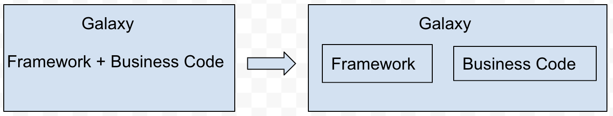
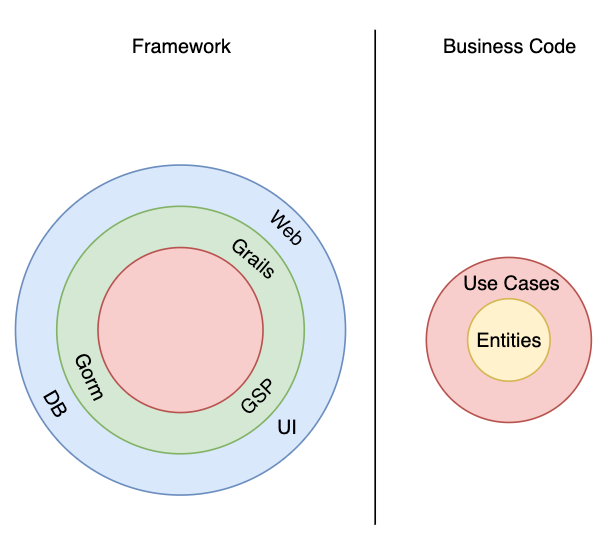
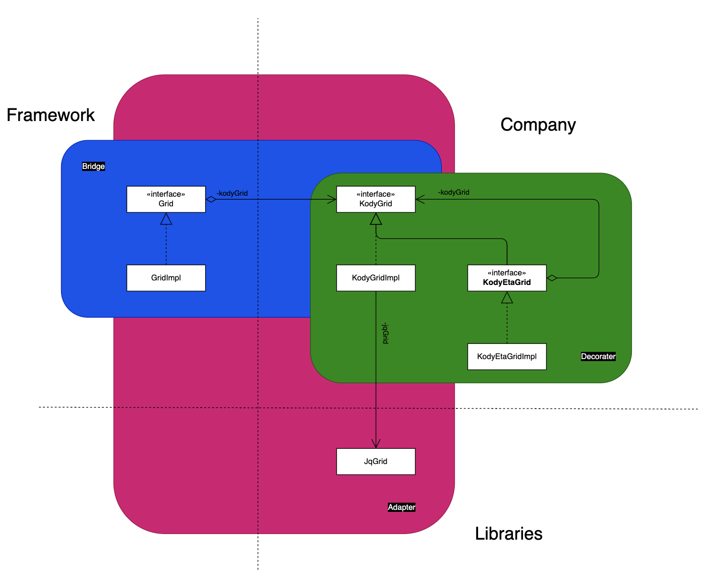

# Galaxy
------------------------------

### The problems that Galaxy project run into
Galaxy is an ERP system including accounts payable system, payroll system, asset management system, and so on.

#### 1. Can we reuse the business code?

The first version of Galaxy is a desktop application and is developed with Silverstream; the second version of Galaxy is a web application and developed with Grails. When we develop an application, usually it includes capturing user's request, validating the data again the business rules, and saving the data to the database. When we switch Silverstream to Grails, the ways to capture user's request, and to save the data to the database will be absolutely different, becaue they are two different framworks. However the way how to validate the data is same, because we still run the same business. When we design the application, can we use [Bridge Design Pattern][1] to devide the code to framework code and business code? The business code could become use cases and entities in Clean Architecture; the Framework code will handle the persistence and web controllers. Instead of call the use case implementation directly, we use interface to build the bundary and [DI][2] to inject the use case implementation to framework code? If so, our application will be Independent of Frameworks.

And then we can follow [BCE][3] and [Use Case Driven Object Modeling with UML Theory and Practice][4] to develop our application.

#### 2. How do we test business rules?

As an ERP system, it has to simulate hundreds of use cases in reality, and fully test each use case. For right now, when we test a use case, we need to set up data in screens, and then test it, this is more like a system test not a unit test. And later on, if when need to test it again, the data maybe changed by someone else or the data alread passes the due date. So can we use unit test to test those use case and ignore the UI and the database? Clean arichitecture can help use to achieve this goal, at least in Uncle Bob Martin's conference video.

#### 3. how to decouple Frontend code?

The frontend code is composite of AngularJS code and libraries code, like JqGrid, JQuery Widgets, they all mixed togerther to make the UI work. And now we have a hard time if we want to update our AngularJS to Angular, because of Angular does not have scope any more. If we could devide the code to framework code, libraries, and company code, this could be easy for us to update framework, and libraries?

[1]: <https://refactoring.guru/design-patterns/bridge> "Bridge Design Pattern"
[2]: <https://en.wikipedia.org/wiki/Dependency_injection> "Dependency Injection"
[3]: <https://www.amazon.com/Object-Oriented-Software-Engineering-Approach/dp/0201544350> "Boundary Control Entity"
[4]: <https://www.amazon.com/Driven-Object-Modeling-UMLTheory-Practice/dp/1590597745#:~:text=Use%20Case%20Driven%20Object%20Modeling%20with%20UML%20%2D%20Theory%20and%20Practice,growing%20following%20over%20the%20years.> "Use Case Driven Object Modeling with UMLTheory and Practice"
