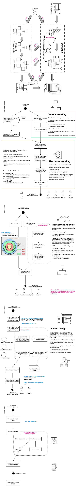

# Use Case Driven Development

The main content of the following image is from books: [Use Case Driven Object Modeling with UML Theory and Practice][4] and [Object-Oriented Software Engineering: a Use Case Driven Approach][3].

It is a whole process about how to convert **Functional Requirements** to **Working Code** in **Industrial System Development**. It frist identifies the actors who will use the application; then identifies use cases of each actor; break each use case into boundary, controll and entity; design the relationship betwen them; and finally imeplements the code.

If we replace the End-User and Customer with Domain Exports, can this approach work with [Domain Driven Development][2]?
 

[2]: <https://www.amazon.com/Domain-Driven-Design-Tackling-Complexity-Software/dp/0321125215> "Domain-Driven Design: Tackling Complexity in the Heart of Software"
[3]: <https://www.amazon.com/Object-Oriented-Software-Engineering-Approach/dp/0201544350> "Boundary Control Entity"
[4]: <https://www.amazon.com/Driven-Object-Modeling-UMLTheory-Practice/dp/1590597745#:~:text=Use%20Case%20Driven%20Object%20Modeling%20with%20UML%20%2D%20Theory%20and%20Practice,growing%20following%20over%20the%20years.> "Use Case Driven Object Modeling with UMLTheory and Practice"
