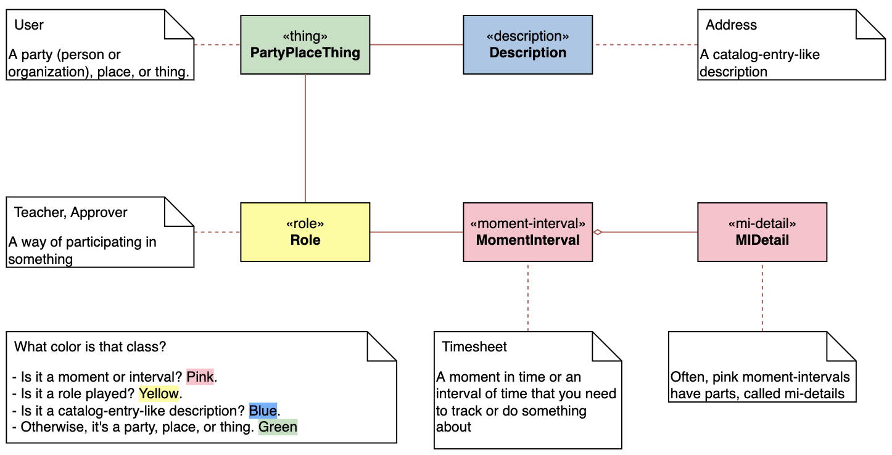

## 1 Archetypes, Color, and the Domain-Neutral Component
------
#### 1.1 Archetypes
**A form from which all things of the same kind more or less follow.**

4 interconnected archetypes that form a domain-neutral component:
##### 1.1.1 The Moment-interval Archetype
The first arhetype in importance is a moment in time or an interval of time. It represents something that one needs to work with and track for business or legal reasons, something that occurs at a moment in time or over an interval of time. For short, we call it a "moment-interval" to help remind us that we are looking for either a moment or an interval of importance in the problem domain.

Like **Timesheet** in Galaxy

##### 1.1.2 The Role Archetype
The second archetype in importance is a role. A role is a way of participation by a party (persion or organization), place, or thing.

Like **Teacher**, **Substitute**, **Approver** in Galaxy.

##### 1.1.3 The Description Archetype
It's a catalog-entry-like description. It is a collection of values that apply again and again. It also provides behavior across the collection of all things that correspond to its description.

Like **Address**.

##### 1.1.4 The "Party, place, or Thing" Archetype
A party (meaning a person or an organization), place, or thing is someone or something who plays different roles.

Like **User** in Galaxy

#### 1.2 Color
###### 1.2.1 Why Use Color?
Add layers of new content to models.

#### 1.3 The Four Archetypes in Color

#### 1.5 The Domain-Neutral Component
These four archetypes in color plug into each other in a very repeatable and predictable way. We call it a "domain-neutral component".

#### 1.6 Interactions within The Domain-Neutral Component
Sequence diagram

#### 1.7 Component Connectivity
1. Direct connectivity: links an object in one component with objects in another component.
2. Plug-in connectivity: interacts with whatever is plugged into a plug-in point (interface).

**For modeling simplicity, build models with direct connections. Then choose where we want flexibility and add plug-in connectivity.**

