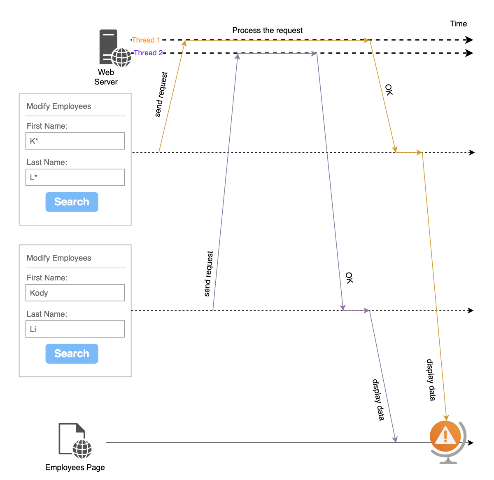
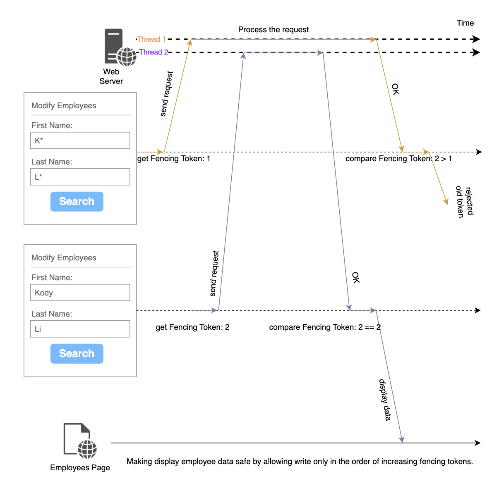

# Showing the Right Data with Out-of-Order Responses in Javascript
- [1. Introduction](#section-1)
- [2. The Scenario](#section-2)
- [3. Challenges and Consequences](#section-3)
- [4. Strategies to Ensure Consistent Data](#section-4)
- [5. Code](#section-5)
- [6. Read More](#section-6)

## 1. Introduction:
In the dynamic realm of web development, handling asynchronous HTTP requests is a common practice. However, ensuring that web pages remain consistent when responses from these requests arrive out of order is a challenge. In this article, we explore a common issue: when response A, initially sent before response B, returns after B. We'll delve into strategies, including the use of fencing tokens, to avoid the risk of displaying outdated employee data on your web page.

## 2. The Scenario:
Imagine a web application that sends two HTTP requests, labeled A and B, to the same URL, both fetching employee data. Ordinarily, Request A should complete before Request B, but network latency or server load can lead to responses returning out of order. The challenge arises when the delayed response A arrives after Request B has processed, potentially leading to inconsistencies in displayed employee data.

## 3. Challenges and Consequences:
When the delayed response (A) arrives out of order, the web page risks displaying outdated employee data. This can result in inconsistencies in the user experience, such as showing previous employee details, whose name is KK LL, instead of the employee whose name is Kody Li, potentially leading to user confusion or dissatisfaction.

## 4. Strategies to Ensure Consistent Data:
Use a `fencing tokens`. The idea come from the distributed lock.

Let's assume that every time before the request is sent, it will get a `fencing token`, which is a number that increases every time a request is send. We can then require that every time a request need to compare the fencing token before processing the response.

## 5. Code

~~~typescript
/**
 * Represents a class for managing tokens by name.
 */
class LastWin {
  /**
   * The default name for tokens.
   * @type {string}
   * @private
   */
  private DEFAULT_NAME: string;

  /**
   * The starting token value.
   * @type {number}
   * @private
   */
  private START_TOKEN: number = 1;

  /**
   * A map to store tokens by name.
   * @type {Map<string, number>}
   * @private
   */
  private tokens: Map<string, number> = new Map<string, number>();

  /**
   * Creates an instance of LastWin.
   * @param {string} defaultName - The default name for tokens.
   */
  constructor(defaultName: string) {
    this.DEFAULT_NAME = defaultName;
    this.tokens.set(this.DEFAULT_NAME, this.START_TOKEN);
  }

  /**
   * Get the token by name for the default name.
   * @returns {number} The token value.
   */
  get(): number {
    return this.get(this.DEFAULT_NAME);
  }

  /**
   * Get the next token by name for the default name.
   * @returns {number} The next token value.
   */
  next(): number {
    return this.next(this.DEFAULT_NAME);
  }

  /**
   * Check if the given token matches the token by name for the default name.
   * @param {number} token - The token to compare.
   * @returns {boolean} `true` if the tokens match, `false` otherwise.
   */
  win(token: number): boolean {
    return this.win(this.DEFAULT_NAME, token);
  }

  /**
   * Get the token by name.
   * @param {string} name - The name for which to get the token.
   * @returns {number} The token value for the specified name.
   */
  get(name: string): number {
    return this.tokens.get(name) || this.START_TOKEN;
  }

  /**
   * Get the next token by name.
   * @param {string} name - The name for which to get the next token.
   * @returns {number} The next token value for the specified name.
   */
  next(name: string): number {
    const oldToken = this.get(name);
    const newToken = oldToken + 1;
    this.tokens.set(name, newToken);
    return newToken;
  }

  /**
   * Check if the given token matches the token by name.
   * @param {string} name - The name to check.
   * @param {number} token - The token to compare.
   * @returns {boolean} `true` if the tokens match, `false` otherwise.
   */
  win(name: string, token: number): boolean {
    return this.get(name) === token;
  }
}
}

~~~
### 5.1 Display response data on a page
~~~html
<button onclick="searchEmployees()">Search</button>
~~~

#### 5.1.1 Single name
~~~js
const employeeUrl = "/employees";
const lastWin = new LastWin(employeeUrl);

function searchEmployees() {
    let fencingToken = lastWin.next();
    $.ajax({
        url: employeeUrl,
        data: {firstName:"", lastName:""},
        success: function(res){
            if(lastWin.win(fencingToken)){
                //display data to web page.
            }
        }
    });
}
~~~
#### 5.1.2 Multiple names
~~~js
const lastWin = new LastWin();

function searchEmployees() {
    const url = "/employees";
    let fencingToken = lastWin.next(url);
    $.ajax({
        url: url,
        data: {firstName:"", lastName:""},
        success: function(res){
            if(lastWin.win(url, fencingToken)){
                //display data to web page.
            }
        }
    });
}

function searchPositions() {
    const url = "/positions";
    let fencingToken = lastWin.next(url);
    $.ajax({
        url: url,
        data: {firstName:"", lastName:""},
        success: function(res){
            if(lastWin.win(url, fencingToken)){
                //display data to web page.
            }
        }
    });
}
~~~

> It can also integrate with Ajax injector of frameworks and libraries, like angularJS, angular, and Jquery Ajax, so we can handle all requestes together instead of one by one.

### 5.2 Stop loading indicator
Galaxy Indicator:
~~~typescript
class LoadingIndicator {
  constructor() {
    this.overlay = null;
    this.indicator = null;

    this.createStyle();
    this.createElements();
  }

  loading() {
    if (this.overlay) {
      document.body.appendChild(this.overlay);
    }
  }

  idle() {
    if (this.overlay && this.overlay.parentNode) {
      this.overlay.parentNode.removeChild(this.overlay);
    }
  }
                        
  createStyle() {
    // Define CSS styles for the overlay and indicator
    this.styles = {
      overlay: {
        position: "fixed",
        top: 0,
        left: 0,
        width: "100%",
        height: "100%",
        background: "rgba(0, 0, 0, 0.5)",
        zIndex: 9999,
        display: "none",
        alignItems: "center",
        justifyContent: "center",
        display: "flex",
      },
      indicator: {
        width: "100px",
        height: "100px",
        border: "16px solid #f3f3f3",
        borderTop: "16px solid #3498db",
        borderRadius: "50%",
        animation: "spin 2s linear infinite",
      },
    };
  }

  createElements() {
    // Create the overlay element
    this.overlay = document.createElement("div");
    Object.assign(this.overlay.style, this.styles.overlay);
    
    // Create the loading indicator element
    this.indicator = document.createElement("div");
    Object.assign(this.indicator.style, this.styles.indicator);
    
    // Add the indicator to the overlay
    this.overlay.appendChild(this.indicator);
  }

}

~~~
Problems:

1. It may pop up two indicators one after anoter.

2. It may stop the indicator before the http request, that takes a longer time, finished.

~~~typescript
// Usage:
const loadingIndicator = new LoadingIndicator();//AngularJS service

document.getElementById("findBtn")?.addEventListener("click", () => {
  employeeHttp();
  positionHttp()
});

function employeeHttp(){
    loadingIndicator.busy();
    //Ajax call
    loadingIndicator.idle();
}

function positionHttp(){
    loadingIndicator.busy();
    //Ajax call
    loadingIndicator.idle();
}
~~~

New Design:
~~~typescript
class LoadingIndicator {
  private show:LastWin;
  private hide:LastWin;
                        
  constructor() {
    this.overlay = null;
    this.indicator = null;
                 
    this.show = new LastWin("show");
    this.hide = new LastWin("hide");

    this.createStyle();
    this.createElements();
  }

  loading() {
    if(this.show.get() === this.hide.get()){
      document.body.appendChild(this.overlay); 
    }
    this.show.next();
  }

  idle() {
    if(this.show.get() !== this.hide.get()){
       this.hide.next();
       if(this.show.get() === this.hide.get()){
         this.overlay.parentNode.removeChild(this.overlay);
       }
     }
  }

  private createStyle() {
    // Define CSS styles for the overlay and indicator
    this.styles = {
      overlay: {
        position: "fixed",
        top: 0,
        left: 0,
        width: "100%",
        height: "100%",
        background: "rgba(0, 0, 0, 0.5)",
        zIndex: 9999,
        display: "none",
        alignItems: "center",
        justifyContent: "center",
        display: "flex",
      },
      indicator: {
        width: "100px",
        height: "100px",
        border: "16px solid #f3f3f3",
        borderTop: "16px solid #3498db",
        borderRadius: "50%",
        animation: "spin 2s linear infinite",
      },
    };
  }

  private createElements() {
    // Create the overlay element
    this.overlay = document.createElement("div");
    Object.assign(this.overlay.style, this.styles.overlay);
    
    // Create the loading indicator element
    this.indicator = document.createElement("div");
    Object.assign(this.indicator.style, this.styles.indicator);
    
    // Add the indicator to the overlay
    this.overlay.appendChild(this.indicator);
  }

}

~~~

## 6. Read More:

[Showing the Right Data with Out-of-Order Responses in Javascript](https://www.tejusparikh.com/2017/showing-right-data-out-of-order-responses-javascript.html)

[Making the lock safe with fencing](https://martin.kleppmann.com/2016/02/08/how-to-do-distributed-locking.html)