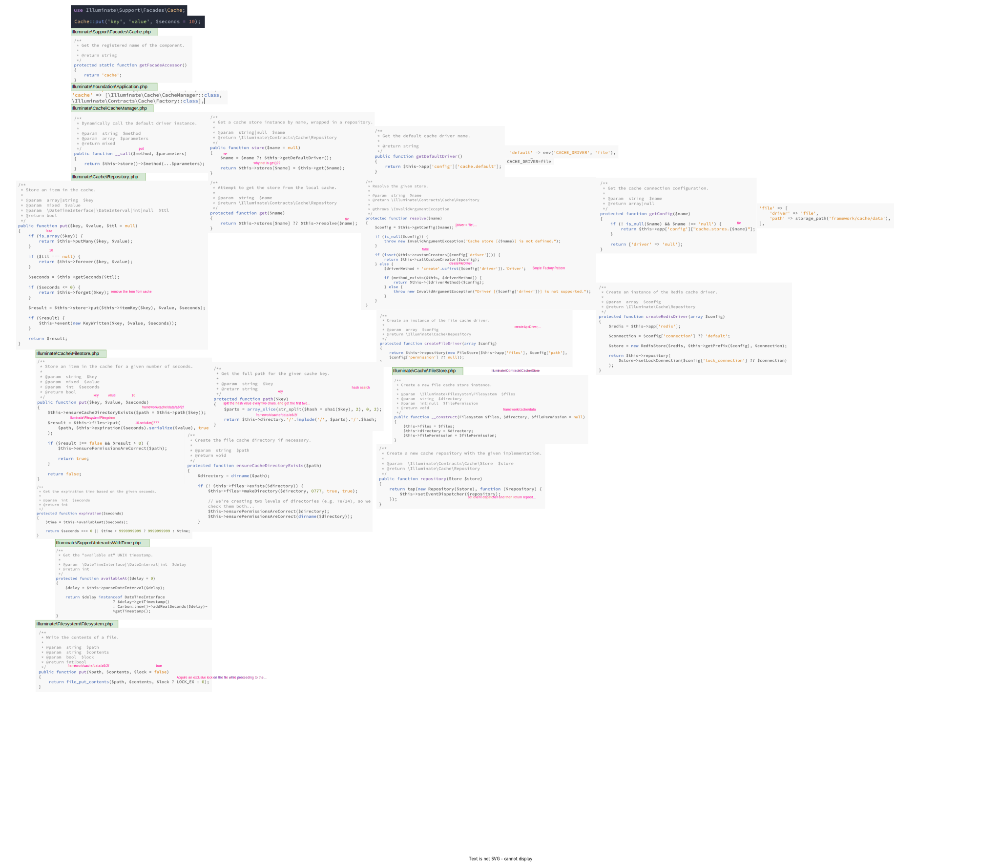

# [Cache](https://laravel.com/docs/9.x/cache)
-----------
### Introduction
Some of the data retrieval or processing tasks performed by your application could be CPU intensive or take several seconds to complete. When this is the case, it is common to cache the retrieved data for a time so it can be retrieved quickly on subsequent requests for the same data. The cached data is usually stored in a very fast data store such as Memcached or Redis.

### [Source Code](https://github.com/laravel/framework/tree/5.5/src/Illuminate/Cache)
It uses [Strategy](https://refactoring.guru/design-patterns/strategy) design pattern, reads configration from Laravel, and creates provider based on the configuration.

