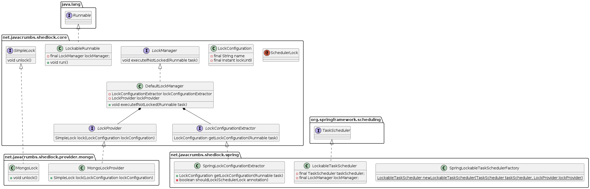

### [Schedule Lock](https://github.com/lukas-krecan/ShedLock/tree/shedlock-parent-0.1.0/shedlock-core)

~~~uml
@startuml
set separator none
package java.lang{
  interface Runnable{}
}
package net.javacrumbs.shedlock.core {

interface LockProvider{
  SimpleLock lock(LockConfiguration lockConfiguration)
}
interface SimpleLock {
    void unlock()
}
class LockableRunnable implements Runnable {
  - final LockManager lockManager;
  + void run()
}
interface LockConfigurationExtractor{
  LockConfiguration getLockConfiguration(Runnable task)
}

interface LockManager{
  void executeIfNotLocked(Runnable task)
}

class DefaultLockManager implements LockManager{
  - LockConfigurationExtractor lockConfigurationExtractor
  - LockProvider lockProvider
  + void executeIfNotLocked(Runnable task)
}
class LockConfiguration {
    - final String name
    - final Instant lockUntil
}
annotation SchedulerLock{}
DefaultLockManager *-- LockProvider
DefaultLockManager *-- LockConfigurationExtractor
}

package net.javacrumbs.shedlock.provider.mongo{
class MongoLockProvider implements LockProvider {
  + SimpleLock lock(LockConfiguration lockConfiguration)
}
class MongoLock implements SimpleLock {
  + void unlock()
}
}

package org.springframework.scheduling {
  interface TaskScheduler{}
}

package net.javacrumbs.shedlock.spring{

class LockableTaskScheduler implements TaskScheduler {
  - final TaskScheduler taskScheduler;
  - final LockManager lockManager;
}

class SpringLockConfigurationExtractor implements LockConfigurationExtractor {
  + LockConfiguration getLockConfiguration(Runnable task)
  - boolean shouldLock(SchedulerLock annotation)
}

class SpringLockableTaskSchedulerFactory {
  {static} LockableTaskScheduler newLockableTaskScheduler(TaskScheduler taskScheduler, LockProvider lockProvider)
}
}

@enduml

~~~
