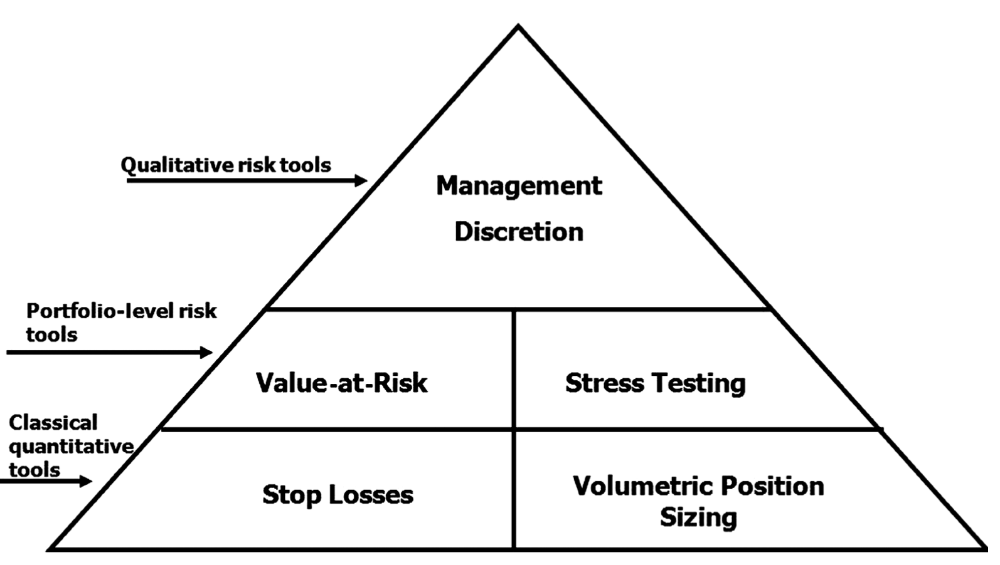
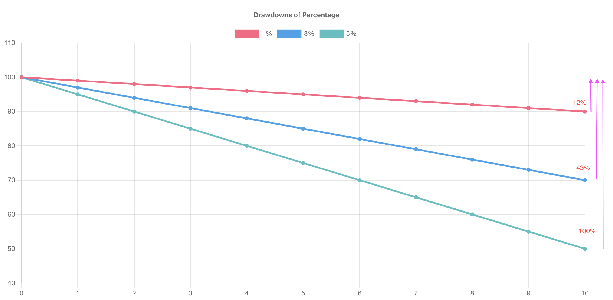

# Trade Like a Casino
----------------------
Thinking in Probabilities

Casino operators have learned that all they have to do is keep the odds in their favor and have a large enough sample size of events so that their edges have ample opportunity to work. 

### 1. Developing Positive Expectancy Models
How do casinos make money on roulette? The House Edge. 
The house edge represents the long run percentage of the wagered money that will be retained by the casino.

Probalitity, and Odds

The house edge on an American roulette wheel, which contains a double zero, is 5.26%. If the odds is 1, for every $1 million that's bet at the roulette tables in a casino, the casino expects to poket a profit of slightly more than $50,000.

Check if the moving win rate is equal to the house edge in practice.

### 2. Price Risk Management Methodologies
Casinos never abandon their table limits. Not once. No exceptions, ever. Why? Because they always assume that any particular spin of the roulette wheel will result in a win for the player despit simultaneously knowing that probability is always skewed in their favor.

So, if you want to make money like a casino, you need to manage the risk. Because even the most robust positive expectancy medels cannot guarrantee a profit on every single trade, so, as traders, we need alwayas to be prepared for the worst and can never be surprised when the worst occurs.

Here is a way to manage risk: **Weissman's Risk Management Pyramid**

#### 2.1 Base of Payramid
Tools at the base of the risk management pyramid are simple, robust, purely quantitative, and universally accepted throughout the speculative trading community.

##### 2.1.1 Stop Losses
It answers where do I exist this position in order to preserve captial.

The vast majority of stops can be broken down into one of three major categories:

a. Mathematically derived technical stop orders.

b. Stopes based on support and resistance levels.
-- They are attuned to "price having memory".

**c. Monetary or percentage-based stops.**
-- Force us to quantity risk in relationship to reward prior to trade entry.

##### 2.1.2 Volumetric position Sizing
It answers how many units of this asset can I trade without becoming overleveraged.

The general guideline regarding volumetric position sizeing in relationship to assets under management is the **1% rule**. This rule states that traders should risk no more than 1 percent of assets under management on any single trade.

This rises another two questions when our account equity has changes: how can we safely increase our position size without increasing risk as our account equity increases? Also, how do we determine when it is necessary to decrease our volumetric position size as our account equity descrease?

One of the best-known techniques is **Ralph Vince's fixed fractional position sizing**. The most conservative way of fixed fractional position sizing is to look at the worst peak-to-valley drawdown over the back-tested period.

#### 2.2 Middle of Pyramid
Quantitative tools in the middle level of the risk management pyramid offer robutst solutions to issues, including correlations between assets held in a portfolio as well as the volatilities of those assets.
##### 2.2.1 Value-at-Risk
Volatility and Correlations.

VaR examines the historical volatility of assets held in a trading portfolio and the correlations between those assets so as to make our stop loss placement and volumetric position sizing more robust.

Price movement no correclations between assets.

Standard Deviation

Value-at-risk methodologies attempt to quantify the standard de- viation (or historical volatility) of a trading asset or portfolio of assets and the historical correlations between these assets in order to answer the question: “What is the likelihood of our losing X dollars or more over a specified time horizon under normal market condi- tions?”

##### 2.2.2 Stress Testing
Correlation Breakdown
Stress testing attempts to determine how bad this low probability event could become.

#### 2.3 Apex of Pyramid
##### 2.3.1 Management Discretion

### 3. Maintaining Unwavering Discipline
How does the casino handle inevitable periods of player success? Do they become despondent, close the casino, or start betting on the sucess of the players? Quite the contrary; when players win, the casino goes wild with lights and noises, all empha- sizing the point that despite probability favoring the house, it is possible for players to win. The goal is to have the casino’s attitude of unwavering discipline in the face of losses.

**Lack of Confidence in the Model.**

### 4. Analyzing Performance
This section explores a variety of techniques for consistently and exhaustively examinging your actions so you can eliminate delusional notions and learn from your trading results.

#### 4.1 A Due Diligence Questionnaire
##### 4.1.1 About the Trader
These questions force traders to examine their unique circumstances and how such cicumstances affect their operation in the markets. Included in this section are questions regarding issues of trading time constraints, financial constraints, liquidity risk issues, and psychological trading biases.

1. Do you have other professional time commitments?
Determines the types of tradinbg models. For example, if you are working a nine-to-five job,it is unrealistic to manually execute a scalping or day trading model in U.S. equities.
2. What prevents you from giving up during drawdowns or from becoming reckless during winning streaks?
3. Have you deviated from your methodologies and if so, why?
Be as specific as possible in answering this question, as it is the single most essential ingredient to improving performance.
4. After deviating from your methodogies, what specific steps do you take to prevent deviation in the future?
Forgive yourself but do not deny or forget. Use the experience to learn about yourself as a trader.
5. What are your total assets under management?
6. What thresholds of assets under management will impede your ability to trade specific instruments?
7. What thresholds of assets under management will limit your ability to execute strategies currently traded?
8. Did you develop these models?
If you did not develop the strategies traded, are they a black box?
9. Does your organization follow a specific protocol in trading new traders?
Paper trade on a demo version of your broker's execution platform. This accomplishes serveral things, including familiarizing traders with trade execution on the platform, encouraging testing, and development of rule-based positive expectancy methodologies as well as somewhat acclimating them to the emotional and intellectual challenges of speculative trading.

##### 4.1.2 About the Performance Redcord

1. Is your performance record real or hypothetical?
This section offers readers a comprehensive trading jouranl for use as a template to track one's trading performance record. 
2. What assets are currently traded?
This question forces us to examine the volatility of assets traded, position-sizing issues, liquidity risk, and correlations of assets traded.
3. Does the typical number of trades executed change during wining or losing periods?
This question force beginners to identity periods of revenge trading, in addition to alerting more experienced traders as to how their models are affected by bull and bear markets as well as if they are affected by the cyclical nature of volatility.

##### 4.1.3 About the Methodologies
The primary purpose of questions regarding methodologies is the identification and elimination of irrational trading biases. That stated, these questions also force traders to systematically strengths and weaknesses of their methodologies, whcih often results in modifications so as to make the models more robust.

1. How would you describe all of the various methodologies employed?
2. Are the models used always in the market or do they allow for neutrality? If they allow for neutrality, what percentage of time are they in the markets?
3. Are you using the same methodologies in all markets, and if methodologies employed differ, why?
The answer here often relates to whether the methods used are driven by technicals or fundamentals. Technical models typically apply the same methodologies to all markets, whereas fundamentally driven models are often attuned to the unique idiosyncrasies of each market traded.
4. Are trade entry and exit criteria different?
5. Do the methods work better on a specific time horizon?
6. Are the methods more robust in specific types of market environments?
7. What are the strengths and weaknesses of the methods used?
8. How frequently are changes made to the methodologies?
Modification of positive expectancy models is an integral aspect of making methodologies more robust, but the process should be done in a systematic, rational manner through research and back testing before implementation as opposed to emothionally charged Monday morning quarterbacking.
9. Do your methodologies capitalize on diversification?
10. How do you determine assets traded?
11. How do you determine entry, exits, and stops?
12. How do you determine position size and leverage?
13. Do you add to or reduce exposures on winning positions? Do you reduce exposures on lossing positions? And if so, how?
14. Is fundamental information used? If so, does it affect risk management?
15. How do you deal with price shock events?
16. Describe the indicators used and how they form your methodologies?
17. Do your models have long or short biases?
18. Will methods or markets traded change as assets under management increase?
19. What are your rate of return and worst peak-to-vally equity drawdown objectives?
20. What type of instruments(cash foreign exchaange, futures, options, equities, futures spreads, and so on) do you trade?
Trading of various vehicles entails specific types of liquidity risk, time constraints, volatitity issues, price shock event risk, and so on.
##### 4.1.4 Risk Management
1. How are position-sizing limits determined?
2. How are you accounting for correlations between assets traded and changes in volatitities of assets?
The safest way to work with correlations is to use them as risk management tools to prevent overleveraging. Correlations change all the time, and then they change again.
3. What is the maximum margin to total account equity ratio? What is the maximum at risk in any single asset class?
4. Does adding or reducing positions in one asset class affect the size of positions or entry orders in other instruments?
Correlation studies should help in telling us when to reduce positions in one market because of positions in other markets.
5. Types of stops used?
Time-based stops, indicatior-driven stops, price stopes, volatility stops, and money management stops. Make sure the type of stops used suits your trading personality and risk tolerances.
6. Do you adjust position size following significant profits or losses?
7. Are there extreme events in which all open positions would be closed?
8. What percentage drawdown would result in closure of your account?
20%?

##### 4.1.5 Trade Execution Considerations
Execution considerations are especially useful in forcing traders to identify and plan for real-time implementation of the methodologies.

1. Do you execute trades 24 hours a day?
2. What types of orders are used for entry, exiting with profits, and exiting with losses?
3. Are your orders executed electronically? Is order entry manual or automated?

##### 4.1.6 Research and Development Considerations
Questions in this section force readers to face the reality of how much time and resources are presently dedicated to the research and development process.
1. Describe your research and development process, including the process for modification of methodologies.
We do not abandon our positive expectancy model in real-time trading until we are absolutely certain that this new model is more robust and a superior fit for our trading personality.
2. How much time and money do you dedicate to research each month?

### 5. Trading Journal
